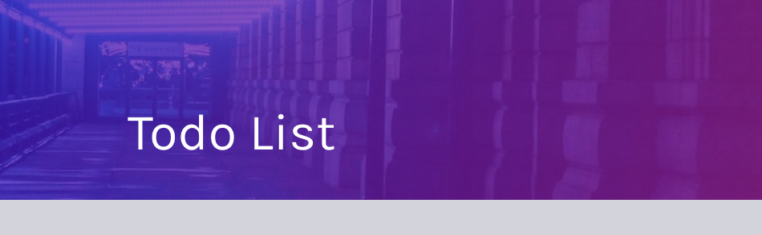

# Todo List

<p align="center" >



</p>
<p align="center">
    
</p>

## 🧪 Technologies

This project was developed using the following technologies:

- [ReactJS](https://reactjs.org/)
- [Styled Components](https://styled-components.com/)
- [Go-lang](https://go.dev/)
- [MySQL](https://dev.mysql.com/)


## 🚀 Getting started

Clone the project and access the folder.

Run this command to install the dependencies.

```bash
git clone https://github.com/eziiel/todo.git

cd todo

npm install

npm run dev
```

You need intall Go for create server-API.

You need install MySQL, in Mysql create DataBase for Todo.

in folder /src/go/table/main.go - function acessDB() - put your user, password and DataBase created.

the same is done in /src/go/main.go - function acessDB().
```
user := "xxxxxxx"
passWord := "xxxxxxx"
dataName := "xxxxxxx"
```

Then run this command to create table and adding a default row.

```
cd src/go/table
cd go run main.go - create table in MySQL

```
Back folder and run server

```bash
cd src/go/

go run main.go - open server for datalist
```


Made with 💜 by [eziiel](https://github.com/eziiel) 🙌🚀

